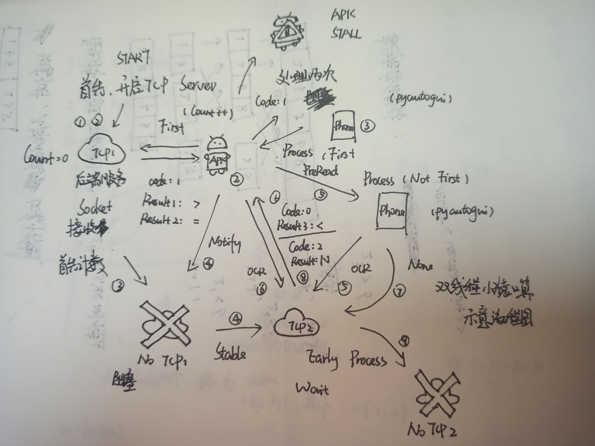
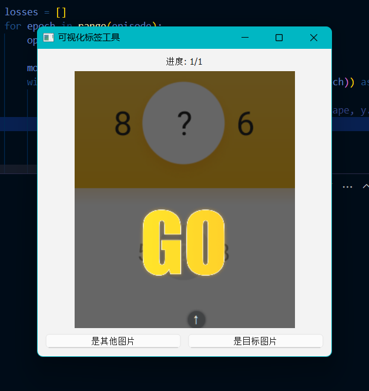
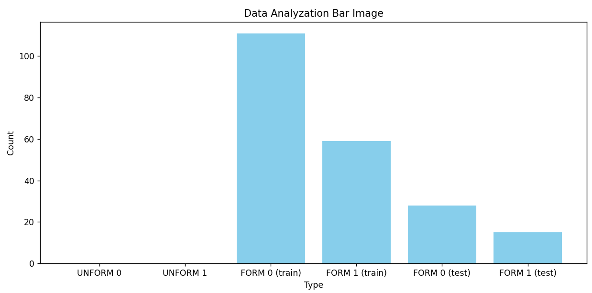
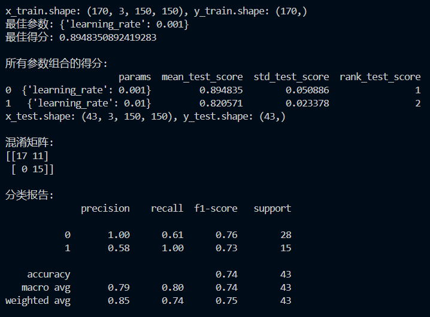

# 小猿口算自动化脚本（基于视觉）
1.支持鼠标监听框选功能，支持快速收集图片并打好标签

2.配有神经网络训练工程，快捷训练和调试

## 前排声明
本项目基于 GPL-2.0 项目，不可闭源，同时新增文件采用相同许可证

不可用于出售、转载、售卖，请尊重他人劳动成果

十分欢迎给出您宝贵的建议，欢迎各路大神提 issue

## 主程序设计
为了让程序不那么枯燥，本项目加了几个对点位的显示和按钮（配置文件保存在 _p.npy 里，不要乱动）

（其中，A、B、C、D 分别表示四个识别区域（上面两个数字和下面两个数字），E 表示鼠标绘制起点（由鼠标按下和松开的中点决定））


下面我们来讲一下一些零部件

### 后端 Server, 双线程同步工作实现加速！！！

下面这张图就是全部的思路啦！！（写的比较抽象）



我们给出以下解释：

---
$`假设流程A（截图+处理+识别）耗时 t_1`$
$`流程B（绘制图像）耗时 t_2`$
$`动画时间 t_3`$

$`那么第一次的 T_0 = t_1 + t_2 + t_3，其余 T_n = t_2 + t_3`$
$`理论速度 T = 10 ( t_2 + t_3 ) + t_1`$

而我们使用 Android 无障碍套件时（连点器）
$`我们可以让 t_2 ≈ 0 ，那么理论速度就是 10 t_3 + t_1 + o( t_2 )`$

$`本机数据交换是极其迅速的所以忽略，而启动套件时间算给 t_2`$
$`人类时间 t_h >> t_2 ，所以我们认为 \frac{t_2}{t_h} = 0，忽略不计`$

---

用简单易懂的公式解释一下：

$`T = 10 (t_2 + t_3) + t_1`$

$`T' = 10 t_3 + t_1 + o(t_2)`$

$`t_h >> t_2, 也就是 \frac{t_2}{t_h} = 0`$

$`T_h < T'`$

---
屏幕刷新率是60hz
Resnet18+cuda:0 计算 60 张 128*128 图像时间 <1s
接下来就是从图像转换扣细节
$`所以t_3优化好了`$

pyautogui.screenshoot 加 region 加速提取
加上 ddddocr 识别四次（0.012s）
$`这是 t_1`$

$`t_3 定死后就是卷 t_1`$
同时尽量不要抢占cpu资源
采取通知的方式
让虚拟机拥有更高性能

---

大前提：所有计算均正确。

当然这都是理想情况，也就是你的异步交互是完美的，但实际上没那么好多所以本项目才做到平均 0.49s 的智能识别方案，单线程的话大约是0.68s。

### 安卓无障碍套件加速

这个加速挺明显的，本项目中存在单线程且不使用无障碍套件的，速度大约是 1.78s

说是套件，实际上就是 Android 内部的一个服务。人话：连点器

##### 当然，这是预先录制好的符号绘制方案，和连点器对撞有本质上的区别！！！

pyautogui 很卡，真机 adb 也很卡（因为要转换图片格式 \r\n -> \n，所以不堪入目）

### 神经网络鉴定是否开始运行

本文使用 Resnet18 作为分类网络，当网络连续输出 6 次类别1（也就是口算进行中的界面）时，就会启动所有服务。

这样就可以做到先点击按钮之后挂着，等待程序自己执行啦~

### 进度识别功能以实现全面加速（未做完）

这一个还没有做完，希望好心人补一补。（作者的头要炸了）

当前使用的是简单的 OCR 识别进度条（最上面那个），精度堪忧，不能做到 100% 正确。


## 神经网络训练 Toolkit

### 可控制自动图像截屏工具
make_data.py 允许您只有选定框选范围，然后定点进行截图并保存到您的 image 文件夹中作为数据集，配合全套 toolkit 可做到快速开发
```
python make_data.py # 开始间隔为 0.3s 的固定位置屏幕截图
```

### 二分类快速标签工具 & Label 可视化绘制
方便快速将 image 中的图片制作标签，用 analyze.py 进行简易均衡性分析

```
python label.py          # 打开标注软件
python analyze.py        # 绘制成柱状图并显示
```



您可以更容易地看出数据倾斜程度，分多个 Folder 读取了 Label 值， 并绘制成柱状图



### 快速 Label 清理工具 & 自动数据集添加工具
当您清理倾斜的非典型数据时，如果 Label 已经生成，则比较棘手

对本项目提供 Label 清理工具，使用时需要保证需要留下的 Image 和 Label 同名，不支持清理 Image ！！

```
python clean.py -m ALL   # 整理全部图片和标签，也可以规定 UNFORM 或 FORM 指定区域清理
python clean.py -p 0.2   # 将训练集和测试集按照 20% 的比例进行切割
```

在打好标签后，我们就可以直接使用 sample.py 来将数据移动到我们的真实训练目录下


### 数据集快速清理工具

什么？你说你这个数据集不典型、分布不好, 要重新采集？好的，试试下面这条命令

```
# 清空数据之前请务必确认好, 本项目是直接删除的！！！直接删除！！！
python drop_dataset.py  # 清空所有数据, 这是个危险操作！！！
```

### 超参数网格搜索工具
使用 scikit-learn 的 GridSearchCV 来搜索，请保证设备支持 sklearn 和 torch

```
python searchcv.py  # 开启网格搜索
```

#### （p.s. 图片为测试时图片，不代表最终效果）



### 正式训练
正式训练只使用 torch，请将搜索到的参数放入后正式训练

```
python train.py # 开始正式训练
```

可视化表示训练进度，数据集处理在 dataloader.py 中，最后模型会默认保存在 savedata 中

### 查看训练效果

```
python val.py # 查看测试效果, 需要保证测试集存在图片
```

之后会直接弹窗, 默认取四张图片测试

#### （p.s.）本例暂已经适配好了 CUDA，但是没有分布式案例（因为我只有一张卡）

希望每个人都能练出想要的丹，阿门！！！
